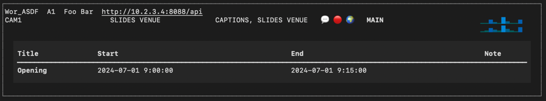

# vMix Hypervisor

To help monitor large event from a single point!

Each operator (group) in separate row, each room in separate card such as:

## Features

- Checks vMix for current status each 5 seconds.
- Downloads fresh copy of schedule from Google Sheets each 5 minutes.

- Displays current inputs in Stream, Slides, Venue
- Shows if captions are working, vMix is recording and streaming.
- Displays list of all active audio inputs and **highlights** the one with some signal.
- Keeps last 10 updates of master audio volume and shows it as a mini bar graph for both channels.
- Lists currently running event(s) according to Google Sheets schedule.
- Provides consistency checks against schedule (beta, ugly) i.e.:
    - If there is currently something happening according to schedule:
        - main camera has to be CAM1, WIDESHOT, or ZOOM CAM
        - slides have to be SLIDES VENUE, VIDEO IS PLAYING or ZOOM SLIDES
        - audio should contain MAIN AUDIO or ZOOM AUDIO
        - recording has to be ON
        - streaming has to be ON
    - If nothing should be happening:
        - main camera has to be STARTING SOON or FINISH
        - slides have to be LOGO
    - In all other cases inconsistencies are shown with red text (or background)

## Config

To make it all work, copy
[credentials.example.py](credentials.example.py) and
[streams.example.json](streams.example.json) files, remove the `.example` in filenames and fill in the requested info.
